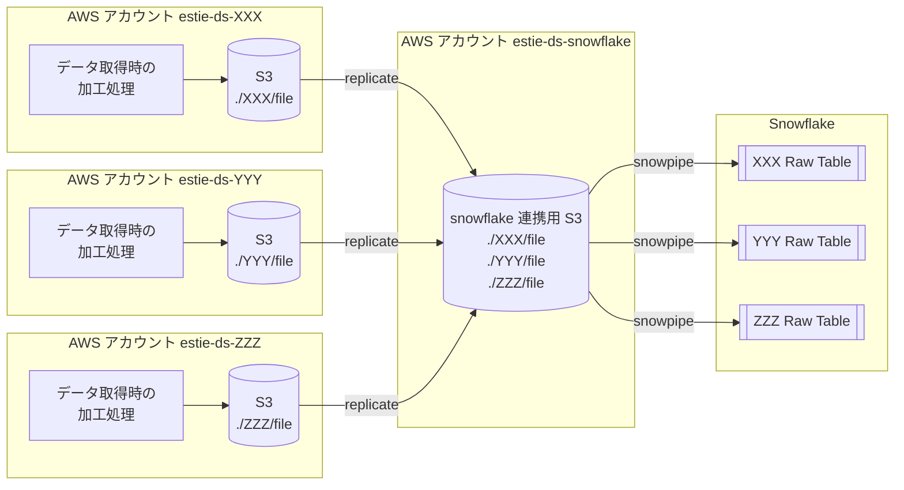

# estie-ds

ds は **D**ata **S**ource の略。

## データの流れ

各データソースに対応する AWS アカウントで作成したデータが Snowflake に連携されるまでの流れのイメージ図は以下。

補足

- AWS アカウント `estie-ds-XXX (YYY, ZZZ)`
    - 各データソースに対応する AWS アカウント。データソースの詳細を知って良い人しかアクセスできない。
- AWS アカウント `estie-ds-snowflake`
    - Snowflake に連携するデータを全て集約ためのアカウント。Snowflake の ADMIN しかアクセスできない。
    - 一度ここにデータを集約するのは Snowflake と S3 の接続設定を簡易化する目的がある。 (storage integration をデータソース毎に作成しなくて良い)
- Snowflake
    - `estie-ds-snowflake` 上のデータを snowpipe でテーブルに取り込む。

## estie-ds-snowflake へのレプリケーション

- ソースバケット設定
    - `estie-ds-snowflake` 上の一つの S3 バケットにデータを集約する方針なので、バッティングを防ぐため必ずデータソース名の prefix をつけてください。
        - 例: データソース `XXX` であれば、`./XXX/(file名)`
- 送信先設定
    - アカウント ID: `818046771625`
    - バケット名: `estie-snowflake-data-sources`
    - `オブジェクト所有者を送信先バケット所有者に変更` を有効に

estie-ds-snowflake 側でもアクセスを許可する設定が必要なので、レプリケーションに使用する IAM を Snowflake 管理チームに連絡してください。
（ここの直接的な連絡プロセスを簡略化できないかは調査中）

<!--
## Hi there 👋

**Here are some ideas to get you started:**

🙋‍♀️ A short introduction - what is your organization all about?
🌈 Contribution guidelines - how can the community get involved?
👩‍💻 Useful resources - where can the community find your docs? Is there anything else the community should know?
🍿 Fun facts - what does your team eat for breakfast?
🧙 Remember, you can do mighty things with the power of [Markdown](https://docs.github.com/github/writing-on-github/getting-started-with-writing-and-formatting-on-github/basic-writing-and-formatting-syntax)
-->
